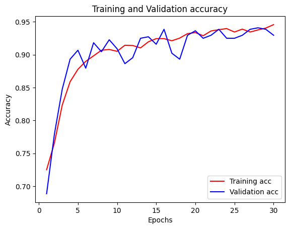
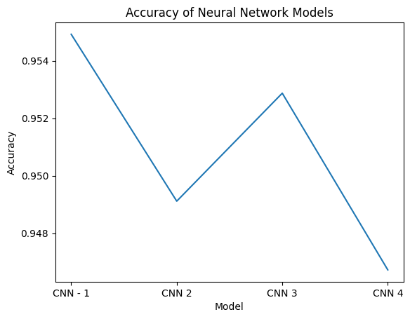
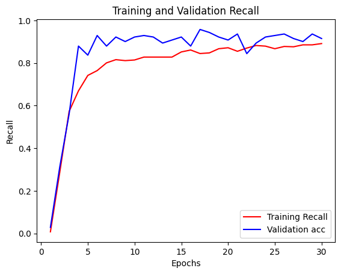
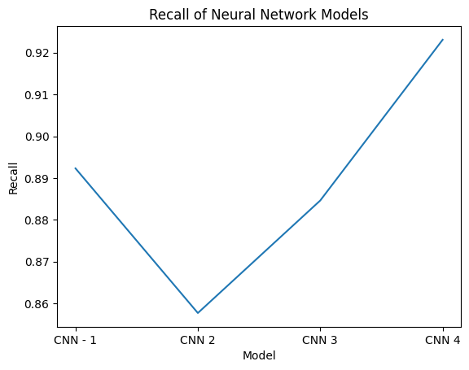
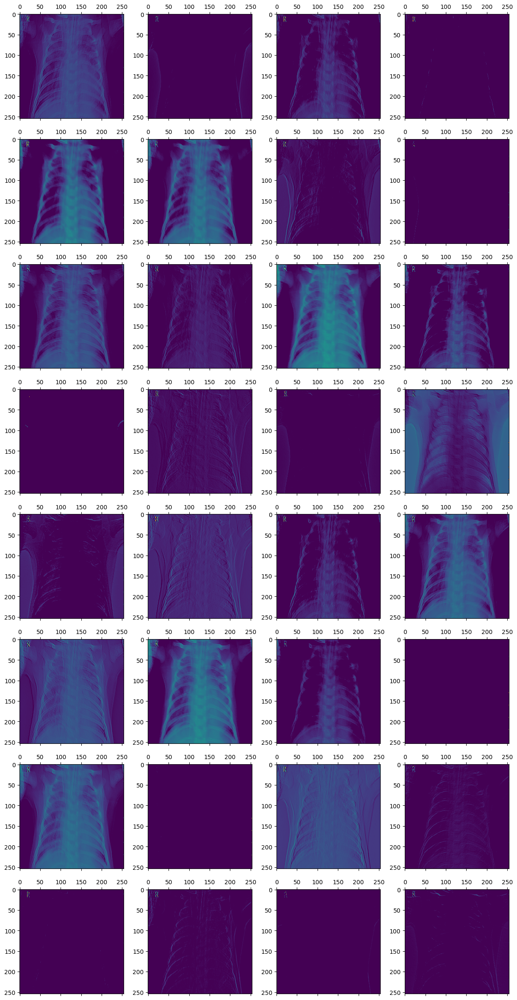
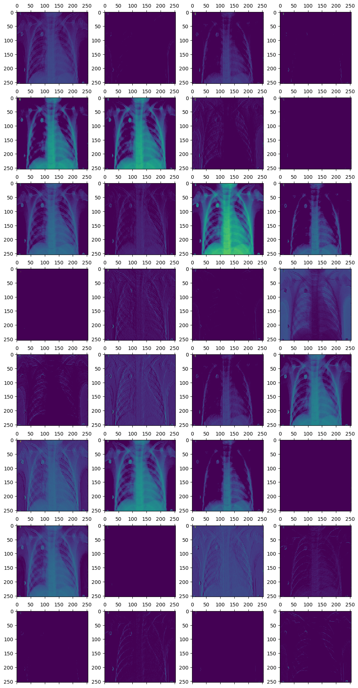

# Pneumonia_Image_Detection

# Background

Pneumonia is an infection that inflames the lungs from many potential vectors: Bacteria, Viruses, Fungi, etc. Pneumonia is a potentially fatal infection, that if not identified early on could put the patient's life at risk especially in acute-care settings.

Data sets off lungs with Pneumonia and healthy lungs were provided by Guangzhou Women and Children’s Medical Center, Guangzhou.

Figure S6. Illustrative Examples of Chest X-Rays in Patients with Pneumonia, Related to Figure 6
The normal chest X-ray (left panel) depicts clear lungs without any areas of abnormal opacification in the image. Bacterial pneumonia (middle) typically exhibits a focal lobar consolidation, in this case in the right upper lobe (white arrows), whereas viral pneumonia (right) manifests with a more diffuse ‘‘interstitial’’ pattern in both lungs.

# Repository Structure

* READ.ME
* index.ipynb: Main notebook containing analysis and calculations
* First_Iteration.ipynb: First iteration at modeling data
* Second_Iteration.ipynb: Second iteration at modeling data
* Models: Contains CNN models generated during study
* Presentation: Folder containing the pdf and powerpoint files of the presentation
* Images: Folder containing images
* chest_xrays: Contains Dataset for project

# Data Structure

The data is stored in chest_xrays. The folder has 3 sub-folders called train, test, and val.

The data is distributed in a very uneven manner across the three. 

- Number of training samples: 5216
- Number of testing samples: 624
- Number of validation samples: 16

As a result, all records were combined then split into training and testing data sets. Process described below under data preparation.

Each off these folders had two folders. They were called 'NORMAL' and 'PNEUMONIA'.

These folders had the images, stored in JPEG off the lungs.

- chest_xray 
   - test 
      - NORMAL 
        - Images of normal lungs 
     - PNEUMONIA 
        - Images of lungs with pneumonia 
   - train 
      - NORMAL 
        - Images of normal lungs 
     - PNEUMONIA 
        - Images of lungs with pneumonia 
   - val 
      - NORMAL 
        - Images of normal lungs 
     - PNEUMONIA 
        - Images of lungs with pneumonia 

# Objectives

The goal is to create a model that accurately predicts if an X-ray of a lung has pneumonia. The model will optimize on two metrics:

Accuracy determines off the overall predictions how many were accurate. False positives in the context of this scenario mean that hospital staff will spend time checking with patients who don't have pneumonia. This could waste resources across the organization.
Recall indicates how many patients were identified to have pneumonia across the overall population of patients that have pneumonia. Having a high recall means you are identifying a high percentage of the patients that have pneumonia. This could correlate into more lives saved.
The final model will be selected based on the accuracy and recall values. Recall will be prioritized over accuracy since saving lives is more important than limiting false positives.

The model will be deployed in a hospital where time is critical. Identifying someone who has pneumonia hours before complications occur can save lives.

# Data Source and Exploration

The total data size has over 5000 images across a training, testing, and validation set. The total size is around 2 gigabits. Due to the size, the data was not pushed to the repository.

To access data download the set from this link: https://www.kaggle.com/datasets/paultimothymooney/chest-xray-pneumonia

Data contains 3 data sets, train, test, and validation. In each file, there are two folders: Pneumonia and normal. Images in the Pneumonia file are named depending on whether the source off the infection is bacterial or viral.

First separate them out based on whether they are normal or have pneumonia.

The images that contain pneumonia are divided based on whether the cause off the ailment was bacterial or viral. Since the purpose of the model is too determine whether Pneumonia is present, we will not distinguish or aim to predict the source off the pneumonia.

However, this distinction will come into play later in the analysis when we investigate the parts off the image the model used to determine if pneumonia is present or not. There is a difference in what part off the lung the model uses to distinguish between the two depending on the source.

# Data Preparation

The Process to prepare the data was as follows:
1. First we used Image Data Generator on the images in the test, train, and val data.
2. Then we created the labels for the target variable. Whether an xray is for a patient with Pneumonia or not.
3. Due to the disparities between the given training, testing, and val set, all data was combined into one dataset.
4. Data then split into training and testing sets. Since Neural Networks are computationally expensive. Two train test splits were done too reduce the size. The final training data set contained nearly 2500 images.

# Modeling

Four models were evaluated through an iterative approach.

## Convolution Neural Network 1

Base model is a simple convolution neural network. Contains one convolution layer, one pooling layer, and 10 neurons in the dense layer.

This model has achieved a ~96% accuracy on the training data set and a 95% accuracy on the testing data set.

## Convolution Neural Network 2

This network contained:
* Three Convolutional Layers and three pooling layers
* Dense Layer contains 30 neurons

Accuracy of training and testing data is 96%.

## Convolution Neural Network 3

* Three Convolution layers
* Three Pooling layers
* 30 neurons in the dense layer
* Added a dropout parameter of 0.25

Adding a dropout rate did not significantly change the accuracy off the models. The training accuracy was 94% and the testing accuracy was 95%.

## Convolution Neural Network 4

* Three Convolution layers
* Three Pooling layers
* 30 neurons in the dense layer
* Added a dropout parameter of 0.25
* L2 regularizer parameter off 0.001 Added

Training Accuracy is 93% and testing accuracy is 95%. The training accuracy dropped somewhat.

# Final Model Evaluation

Based on the accuracies above, the first neural network with one convolution layers and no regularizers or drop out had the highest accuracy.

Ultimately, all models had accuracies within a percentage point from one - another. It would not be surprising if one of the models with regularization performed better on a different data set with significantly more records.

If this were based on accuracy alone then the first convolution neural network would be the choice.

However, the first, second, and third models had lower recalls. The fourth models had a higher recall by nearly 3-6 percentage points.

In addition, when reviewing the plots off the accuracy/loss over the epochs, we noticed that the models without any regulation had significant variance than the ones that did not.

Given the fact that the fourth model had a higher recall and less variability, the fourth model is the one we choose.

This graphic shows how accuracy over the epochs for the final model.

This graphics shows the acurracy across all models. While the fourth had the lowest accuracy, it was only 1% lower than the first.

This graphic shows the recall over the epochs for the final model.

This graphic shows the recall across all models. The fourth had the highest recall by 3 percentage points. Meaning it correctly identified 92% of all lungs with pneumonia.

# Feature Analysis

The above images display the feature maps generated by each convolutional layer. These maps identify unique patterns.

# Conclusion and Recommendations

* Recommend that you move forward with using the final model since it had the highest recall by 3% and only was 1% less accurate than the other models. 
* Further research on how to operationalize this model in hospital workflows. Examples:
* How are false positives and negatives handled in a hospital? 
* Is there a method for clinicians to quickly determine that the patient does not have pneumonia?
* Training on larger and more diverse data sets is necessary before it’s deployed. 

# Contact Information
- Github Link:https://github.com/dragunat2016/Pneumonia_Image_Detection
- Linkedin: https://www.linkedin.com/in/dhruv-ragunathan-908993b1/